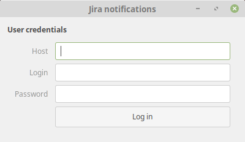

Jira notificator
=================

A notification application for cloud based Jira workspace. Notifications are directly fired using environment with a custom audio tone. Useful in case of disabled email notifications.

The notificator consists of CLI and GUI version. Both are cross-platform for Linux, Mac and Windows.

_Note: Linux version might require instalation additional of libraries._

# Installation

Follow the instructions.

## Windows + Mac:

Just [download](https://github.com/vlachmilan/jira-notificator/releases) the latest version and open the app. There should be no other requirement.

## Linux

_The installation process described below has been designed for Ubuntu based distributions, it might differ for other distros. If so, **please open new [issue](https://github.com/vlachmilan/jira-notificator/issues)**._

1. `sudo apt install libasound2-dev`
2. `sudo apt install libgtk-3-dev`
3. `sudo apt install notify-osd`
4. [download](https://github.com/vlachmilan/jira-notificator/releases) and run the app 

# Screenshots

### UI:

# Credits:

Checkout these amazing projects!

- https://github.com/golang/go
- https://gopkg.in/AlecAivazis/survey.v1
- https://github.com/andlabs/ui
- https://github.com/gen2brain/beeep
- https://github.com/hajimehoshi/oto
- https://github.com/jteeuwen/go-bindata
- https://github.com/golang/dep
- https://www.atlassian.com/

# Licence

MIT
